# Juegos PRODHAB

El presente repositorio reúne todos los recursos utilizados para el desarrollo de tres juegos interactivos, además de un test de evaluación, creados para los practicantes de la PRODHAB.

En este archivo contiene una guía básica para pruebas de implementación, instalación y uso.

Tecnologías:

- ASP.NET Core 8.0.200
- SQL Server 2019 - 2022.
- JS, HTML Y CSS
- NodeJS y ElectronJS (opcional).

## Índice de Contenido

- [Juegos PRODHAB](#juegos-prodhab)
- [Tecnologías:](#tecnologías)
- [Prueba básica sin Servicio Backend de un juego TEST.](#prueba-básica-sin-servicio-backend-de-un-juego-test)
    - [Precondiciones necesarias:](#precondiciones-necesarias)
    - [Prueba rápida del _test.html_](#prueba-rápida-del-_testhtml_)
    - [Explicación paso a paso.](#explicación-paso-a-paso)
        - [1-Importación de módulos.](#1-importación-de-módulos)
        - [2-Ajustar a prueba sin servidor backend](#2-ajustar-a-prueba-sin-servidor-backend)
        - [3-Crear el componente Test](#3-crear-el-componente-test)
        - [4-Ejecutar el servidor y abrir el archivo .html](#4-ejecutar-el-servidor-y-abrir-el-archivo-html)
- [Prueba rápida integración para el menú de juegos.](#prueba-rápida-integración-para-el-menú-de-juegos)
- [Integración del Menú de Juegos Localmente](#integración-del-menú-de-juegos-localmente)
    - [Nota sobre el Script (Modo de Prueba)](#nota-sobre-el-script-modo-de-prueba)
    - [Implementación en JavaScript ES Module](#implementación-en-javascript-es-module)
    - [Implementación en React.js](#implementación-en-reactjs)
    - [Implementación en Angular](#implementación-en-angular)
    - [Implementación ASP.NET Razor Pages.](#implementación-aspnet-razor-pages)
    - [Implementación ASP.NET Blazor Framework.](#implementación-aspnet-blazor-framework)
- [¿Cómo preparar el proyecto y ponerlo en entorno de producción o despliegue?](#cómo-preparar-el-proyecto-y-ponerlo-en-entorno-de-producción-o-despliegue)
    - [Creación de la base de datos en SQL Server.](#creación-de-la-base-de-datos-en-sql-server)
        - [1-Crear una base de datos en SQL server](#1-crear-una-base-de-datos-en-sql-server)
        - [2-Abrir el script de DB_CREATE_DDL.sql y ejecutarlo para crear las tablas.](#2-abrir-el-script-de-db_create_ddlsql-y-ejecutarlo-para-crear-las-tablas)
        - [3-Abrir el scripts DB_DATA.sql y ejecutar para insertar los datos.](#3-abrir-el-scripts-db_datasql-y-ejecutar-para-insertar-los-datos)
        - [4-Verificar que las siguientes tablas contienen los datos:](#4-verificar-que-las-siguientes-tablas-contienen-los-datos)
    - [Configuración de la WEB-API (backend) y variables de entornos en ASP.NET Core.](#configuración-de-la-web-api-backend-y-variables-de-entornos-en-aspnet-core)
        - [1-Crear el archivo appsettings.json del proyecto, puede copiar y pegar el siguiente archivo:](#1-crear-el-archivo-appsettingsjson-del-proyecto-puede-copiar-y-pegar-el-siguiente-archivo)
        - [2-Actualizar la cadena de conexión por el que esta en la base de datos de juegosProdhab.](#2-actualizar-la-cadena-de-conexión-por-el-que-esta-en-la-base-de-datos-de-juegosprodhab)
        - [2-Actualizar la clave secreta para generar los JWT.](#2-actualizar-la-clave-secreta-para-generar-los-jwt)
        - [3-Configurar el entorno para envío de correos para la recuperación de contraseña.](#3-configurar-el-entorno-para-envío-de-correos-para-la-recuperación-de-contraseña)
        - [4-Configurar la cuenta del usuario administrador inicial en la aplicación:](#4-configurar-la-cuenta-del-usuario-administrador-inicial-en-la-aplicación)
        - [5-Configurarar CORS](#5-configurarar-cors)
        - [6-Ejecutar con el comando dotnet clean y después dotnet build.](#6-ejecutar-con-el-comando-dotnet-clean-y-después-dotnet-build)
    - [Preparación y ajustes de los archivos estáticos Web (HTML Y JavaScript)](#preparación-y-ajustes-de-los-archivos-estáticos-web-html-y-javascript)
        - [1-Configurar la URL base de la API.](#1-configurar-la-url-base-de-la-api)
        - [2-Configurar la uicación específica de imágenes y assets:](#2-configurar-la-uicación-específica-de-imágenes-y-assets)
        - [3-Mover todos los archivos que está dentro de la carpeta`vanillaJSESModule` a `wwwroot`.](#3-mover-todos-los-archivos-que-está-dentro-de-la-carpetavanillajsesmodule-a-wwwroot)
    - [Ejecutar o iniciar el proyecto para :](#ejecutar-o-iniciar-el-proyecto-para)
- [Desplegar el proyecto en un servidor:](#desplegar-el-proyecto-en-un-servidor)
    - [1-Compilar en modeo Release el proyecto](#1-compilar-en-modeo-release-el-proyecto)
    - [2-Ubicar el archivo .dll generado en la nueva carpeta ./publish y ejecutar el siguiente comando dotnet ./publish/APIJuegos.dll para verificar el funcionamiento:](#2-ubicar-el-archivo-dll-generado-en-la-nueva-carpeta-publish-y-ejecutar-el-siguiente-comando-dotnet-publishapijuegosdll-para-verificar-el-funcionamiento)
    - [Alojar la carpeta ./publish en un servidor](#alojar-la-carpeta-publish-en-un-servidor)
- [Crear el módulo administrador en versión escritorio.](#crear-el-módulo-administrador-en-versión-escritorio)
    - [Dependencias necesarias](#dependencias-necesarias)
    - [Archivo package.json](#archivo-packagejson)
    - [Copiar la carpeta vanillaJSESModule y pegarlo en adminJuegosEscritorio.](#copiar-la-carpeta-vanillajsesmodule-y-pegarlo-en-adminjuegosescritorio)
    - [Crear el archivo main.js en caso de que no exista y poner lo siguiente:](#crear-el-archivo-mainjs-en-caso-de-que-no-exista-y-poner-lo-siguiente)
    - [Ejecutar el comando npm start para probar:](#ejecutar-el-comando-npm-start-para-probar)
    - [Modificar la URL Base de la API para que apunte a tal servidor:](#modificar-la-url-base-de-la-api-para-que-apunte-a-tal-servidor)
    - [Crear el proyecto en un ejecutable .exe](#crear-el-proyecto-en-un-ejecutable-exe)
- [Recomendaciones y futuras mejoras](#recomendaciones-y-futuras-mejoras)

## Prueba básica sin Servicio Backend de un juego TEST.

#### Precondiciones necesarias:

- Verifica que JavaScript esté habilitado en el navegador.

- Crea un archivo HTML básico.

- Copia el contenido con las rutas de las dependencias dentro del archivo HTML.

- Inicia un servidor local (por ejemplo con Node.js, Python o Live Server) para poder ejecutar correctamente los módulos ES de JavaScript.

#### Prueba rápida del _test.html_

```html
<!DOCTYPE html>
<html lang="en">
  <head>
    <meta charset="UTF-8" />
    <meta name="viewport" content="width=device-width, initial-scale=1.0" />
    <title>Test</title>
    <style>
      @import url("https://fonts.googleapis.com/css2?family=Raleway:wght@100;200;300;400;500;600;700;800;900&display=swap");
    </style>
  </head>
  <body>
    <script type="module">
      import { CONFIG_JUEGO_PRODHAB } from "./src/juegosEnvironments.js";
      import "./src/components/test/test-component.js";
      CONFIG_JUEGO_PRODHAB.setJsonUrl("juegos.json");
      const testComp = document.createElement("test-component");
      testComp.setAttribute("style-url", "src/components/test/test.css");
      testComp.setAttribute("correcta_svg", "public/images/correcta.svg");
      testComp.setAttribute("incorrecta_svg", "public/images/incorrecta.svg");
      testComp.setAttribute("character_png", "public/images/superdato_2.png");
      testComp.setAttribute("id-test", "2");
      document.body.appendChild(testComp);
    </script>
  </body>
</html>
```

### Explicación paso a paso.

#### 1-Importación de módulos.

El primer módulo se usa para configurar el entorno en pruebas locales y el segundo módulo para utilizar el componente de _test.js_. En este caso se usa 'jsDelivr' al ser archivos alojados en el repositorio remoto, sin embargo se recomienda que descargue el proyecto ya apunte los módulos con su respectivas rutas o directorios.

```javascript
import { CONFIG_JUEGO_PRODHAB } from "./src/juegosEnvironments.js";
import "./src/components/test/test-component.js";
```

#### 2-Ajustar a prueba sin servidor backend

La siguiente línea solo se debe usar para pruebas, lo que esta haciendo es indicar que los datos se los juegos se va obtener en la siguiente ruta del archivo JSON. Esto funciona debido a una validación que verifica en los servicios si es un archivo .json.

```javascript
CONFIG_JUEGO_PRODHAB.setJsonUrl("juegos.json");
```

#### 3-Crear el componente Test

Al probar un componente individual los _assets_ como imágenes y videos se agregan por medio de atributos indicando su ruta o ubicación. El atributo id-test corresponde a los juegos de tipo test que se encuentra en el archivo juegos.json y en el caso de id-test con valor 2 es el test de prueba para el tema de aritmética, tambien se encuentra el 1 de protección de datos.

Datos de prueba:

| id-test | tema               | cantidad de preguntas |
| :------ | :----------------- | :-------------------- |
| 1       | Ciberseguridad     | 7                     |
| 2       | Test de aritmética | 2                     |

La última línea de la función `appendChild` agrega el componente dentro de un contendor.

```javascript
const testComp = document.createElement("test-component");
testComp.setAttribute("correcta_svg", "public/images/correcta.svg");
testComp.setAttribute("incorrecta_svg", "public/images/incorrecta.svg");
testComp.setAttribute("character_png", "public/images/superdato_2.png");
testComp.setAttribute("id-test", "2");
document.body.appendChild(testComp);
```

#### 4-Ejecutar el servidor y abrir el archivo .html

Una vez agregado el contenido dentro del archivo `.html`, ejecuta el servidor local para poder visualizar el componente.

1.  **Ejecutar el Servidor Local**:

    - Inicia el servidor web local utilizando la herramienta de tu entorno de desarrollo.

2.  **Acceder al Archivo en el Navegador**:
    - En el navegador, ingresa la **dirección del servidor** seguida de la **ruta del archivo `.html`** dentro de tu proyecto.

Ejemplo: `http://localhost:8080/test.html`.

<p align="center">
  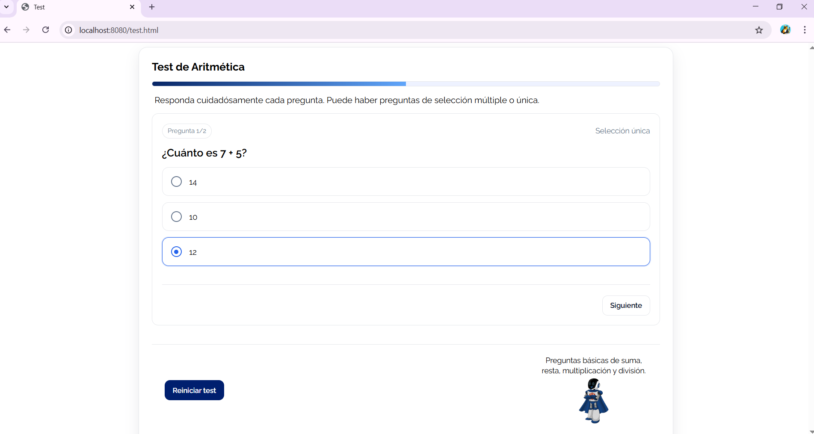
</p>

## Prueba rápida integración para el menú de juegos.

El menú de juegos correspode a la vista principal en donde los usuarios puede seleccionar los juegos a interactuar. Se muestra mediante un modal en la pantalla.

<p align="center">
  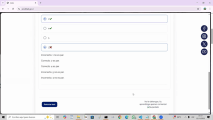
</p>

## Integración del Menú de Juegos Localmente

Siguiendo los pasos anteriores con el componente test, puedes ejecutar el menú de juegos de manera local. Se presentará la implementación en diferentes tecnologías y entornos.

Este archivo HTML es un **ejemplo mínimo** que ilustra cómo integrar el menú de juegos desde cualquier página utilizando **ES Modules**.

El botón **“Abrir Modal”** sirve únicamente como demostración de implementación:

- Al hacer clic, ejecuta la función `openMenuJuegos()`.
- Esta función es la encargada de **cargar el menú dinámico** del proyecto.

### Nota sobre el Script (Modo de Prueba)

En la parte del `script`, se manejan dos aspectos clave:

1.  **Importación de Módulos:** Se importan los módulos directamente desde **GitHub** mediante **jsDelivr**.
2.  **Modo de Prueba Local:** Se utiliza la línea `CONFIG_JUEGO_PRODHAB.setJsonUrl(...)` únicamente como **modo de prueba**.

> **Función del Modo de Prueba:** Esta línea indica al sistema que debe obtener los datos desde un **archivo JSON alojado en GitHub** en lugar de consumirlos desde un _backend_ real. Es útil cuando se quiere probar el proyecto **sin depender de un servidor**, pero en un entorno de producción, normalmente se desactiva para que los datos provengan de la API configurada.

Como sugerencia, se recomienda descargar los archivos originales del repositorio y ubicarlo en un sitio del proyecto en vez de importar los módulos con `jsDelivr`.

#### Implementación en JavaScript ES Module

```html
<!DOCTYPE html>
<html lang="es">
  <head>
    <meta charset="UTF-8" />
    <title>Modal Dinámico</title>
    <meta name="viewport" content="width=device-width, initial-scale=1" />
    <style>
      @import url("https://fonts.googleapis.com/css2?family=Raleway:wght@100;200;300;400;500;600;700;800;900&display=swap");
    </style>
  </head>
  <body>
    <button id="abrirModalBtn">Abrir Modal</button>
    <script type="module">
      import { openMenuJuegos } from "https://cdn.jsdelivr.net/gh/AlbinJunLiang/prodhabpracticantestemporal/src/app.js";
      import { CONFIG_JUEGO_PRODHAB } from "https://cdn.jsdelivr.net/gh/AlbinJunLiang/prodhabpracticantestemporal/src/juegosEnvironments.js";

      CONFIG_JUEGO_PRODHAB.setJsonUrl(
        "https://cdn.jsdelivr.net/gh/AlbinJunLiang/prodhabpracticantestemporal/juegos.json"
      );

      const boton = document.getElementById("abrirModalBtn");
      boton.addEventListener("click", () => {
        openMenuJuegos();
      });
    </script>
  </body>
</html>
```

#### Implementación en React.js

Importar los módulos en el archivo index.html

```html
<!DOCTYPE html>
<html lang="en">
  <head>
    <meta charset="UTF-8" />
    <meta name="viewport" content="width=device-width, initial-scale=1.0" />
    <title>React Hello World</title>
  </head>
  <body>
    <div id="root"></div>
    <script type="module">
      import { openMenuJuegos } from "https://cdn.jsdelivr.net/gh/AlbinJunLiang/prodhabpracticantestemporal/src/app.js";
      import { CONFIG_JUEGO_PRODHAB } from "https://cdn.jsdelivr.net/gh/AlbinJunLiang/prodhabpracticantestemporal/src/juegosEnvironments.js";
      CONFIG_JUEGO_PRODHAB.setJsonUrl(
        "https://cdn.jsdelivr.net/gh/AlbinJunLiang/prodhabpracticantestemporal/juegos.json"
      );
      window.openMenuJuegos = openMenuJuegos;
    </script>

    <script type="module" src="/index.jsx"></script>
  </body>
</html>
```

Crear un componente en react.

```javascript
import React from "react";

const ModalJuegos = () => {
  return <button onClick={() => window.openMenuJuegos()}>Abrir Juegos</button>;
};

export default ModalJuegos;
```

Renderizar el componente app.js

```javascript
import React from "react";
import ModalJuegos from "./ModalJuegos";

function App() {
  return (
    <div>
      <ModalJuegos />
    </div>
  );
}

export default App;
```

#### Implementación en Angular

En producción puede importar archivos .js usando `typings.d.ts` puede convertir tu código JS a módulos ES6 compatibles con Angular. Es mucho menos código al importar los módulos desde el componente.

```js
//Archivo typings.d.ts (Con archivos descargados localmente)
declare module "*.js";
```

Para probar en angular con `jsdelivr` debe importar los módulos en el archivo `index.html`:

```html
<!DOCTYPE html>
<html lang="en">
  <head>
    <meta charset="utf-8" />
    <title>Presentacion</title>
    <base href="/" />
    <meta name="viewport" content="width=device-width, initial-scale=1" />
    <link rel="icon" type="image/x-icon" href="favicon.ico" />
  </head>
  <body>
    <app-root></app-root>

    <script type="module">
      import { openMenuJuegos } from "https://cdn.jsdelivr.net/gh/AlbinJunLiang/prodhabpracticantestemporal/src/app.js";
      import { CONFIG_JUEGO_PRODHAB } from "https://cdn.jsdelivr.net/gh/AlbinJunLiang/prodhabpracticantestemporal/src/juegosEnvironments.js";

      // los exponemos al window para que Angular pueda usarlos
      window.openMenuJuegos = openMenuJuegos;
      window.CONFIG_JUEGO_PRODHAB = CONFIG_JUEGO_PRODHAB;
    </script>
  </body>
</html>
```

Generar un nuevo componente `app-modal-juegos`

```typescript
import { Component } from "@angular/core";
declare const openMenuJuegos: any;
declare const CONFIG_JUEGO_PRODHAB: any;

@Component({
  selector: "app-modal-juegos",
  standalone: true,
  templateUrl: "./modal-juegos.component.html",
  styleUrls: ["./modal-juegos.component.scss"],
})
export class ModalJuegosComponent {
  ngOnInit() {
    CONFIG_JUEGO_PRODHAB.setJsonUrl(
      "https://cdn.jsdelivr.net/gh/AlbinJunLiang/prodhabpracticantestemporal/juegos.json"
    );
  }

  abrirModal() {
    openMenuJuegos();
  }
}
```

Colocar en el archivo `html` del `app-modal-juegos` el evento:

```html
<button (click)="abrirModal()">Abrir Juegos</button>
```

Luego mostramos el componente en el `app.component.ts` importando el componente y colocando la etiqueta en el `app.component.html`:

```html
<app-modal-juegos></app-modal-juegos>
```

#### Implementación ASP.NET Razor Pages.

Crear un archivo .`cshtml` y colocar lo siguiente:

```js
@page "/modal-juegos"
@using System
@using System.Collections.Generic

<button id="abrirModalBtn">Abrir Modal</button>
<script type="module">
   import { openMenuJuegos } from "https://cdn.jsdelivr.net/gh/AlbinJunLiang/prodhabpracticantestemporal/src/app.js";
   import { CONFIG_JUEGO_PRODHAB } from "https://cdn.jsdelivr.net/gh/AlbinJunLiang/prodhabpracticantestemporal/src/juegosEnvironments.js";

   CONFIG_JUEGO_PRODHAB.setJsonUrl("https://cdn.jsdelivr.net/gh/AlbinJunLiang/prodhabpracticantestemporal/juegos.json");

   const boton = document.getElementById("abrirModalBtn");
   boton.addEventListener("click", () => {
     openMenuJuegos();
   });
</script>

```

#### Implementación ASP.NET Blazor Framework.

Crear un nuevo archivo modal.js en la carpeta `wwwroot` y poner lo siguiente:

```js
import { openMenuJuegos } from "https://cdn.jsdelivr.net/gh/AlbinJunLiang/prodhabpracticantestemporal/src/app.js";
import { CONFIG_JUEGO_PRODHAB } from "https://cdn.jsdelivr.net/gh/AlbinJunLiang/prodhabpracticantestemporal/src/juegosEnvironments.js";

CONFIG_JUEGO_PRODHAB.setJsonUrl(
  "https://cdn.jsdelivr.net/gh/AlbinJunLiang/prodhabpracticantestemporal/juegos.json"
);

window.abrirModalJuegos = function () {
  openMenuJuegos();
};
```

Cargar el archivo nuevo .js en el `html` principal.

```html
<!DOCTYPE html>
<html lang="en">
  <head>
    <meta charset="utf-8" />
    <meta name="viewport" content="width=device-width, initial-scale=1.0" />
    <base href="/" />
    <link rel="stylesheet" href="bootstrap/bootstrap.min.css" />
    <link rel="stylesheet" href="app.css" />
    <link rel="stylesheet" href="MiAppBlazor.styles.css" />
    <link rel="icon" type="image/png" href="favicon.png" />
    <HeadOutlet />
  </head>
  <body>
    <Routes />
    <script src="_framework/blazor.web.js"></script>
    <script type="module" src="js/modal.js"></script>
  </body>
</html>
```

Crear un nuevo componente `.razor` y colocar el siguiente código:

```csharp

@page "/modal"
@rendermode InteractiveServer
@inject IJSRuntime JS


<button @onclick="AbrirModal">Abrir Modal</button>

@code {
    private async Task AbrirModal()
    {
        await JS.InvokeVoidAsync("abrirModalJuegos");
    }
}

```

## ¿Cómo preparar el proyecto y ponerlo en entorno de producción o despliegue?

En esta sección se aclara lo básico para poner en ejecución todo el proyecto general siguiento los siguientes niveles:

- Creación y configuración de Base de datos (MSSQL) con sus datos iniciales.
- Configuración del backend y las variables de entornos.
- Configuración de los componentes webs de los juegos (HTML).

### Creación de la base de datos en SQL Server.

- Debe contar con SQL Server 2019 - 2022.
- Tener los dos scripts `DB_CREATE.sql` y `DB_DATA.sql`.

[Enlace de documentación de microsoft para ejecutar los scripts de creación.](https://learn.microsoft.com/es-es/sql/relational-databases/databases/create-a-database?view=sql-server-ver17)

#### 1-Crear una base de datos en SQL server

Puede hacer desde el gestor de base de datos SQL Server Management. También puede hacerlo desde el comando o instrucción en SQL:

```sql
CREATE DATABASE JuegosProdhab;
```

#### 2-Abrir el script de `DB_CREATE_DDL.sql` y ejecutarlo para crear las tablas.

Debe cambiar la priemera línea de instrucción:

**use [nombreDeLaBaseDeDatos]**

Por el nombre de la base de datos crea ya sea `JuegosProdhab` o el nombre que le puso y luego ejecutar todo el script para que se cree las tablas

#### 3-Abrir el scripts `DB_DATA.sql` y ejecutar para insertar los datos.

Al igual que en el anterior scripts también se debe indicar la misma base de datos a ejecutar los scripts por `JuegosProdhab` o el nombre de la base de datos:

<p align="center">
  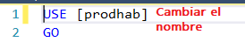
</p>

#### 4-Verificar que las siguientes tablas contienen los datos:

Los siguientes datos son obligatorios para el funcionamiento correcto de la base de datos y en ambas tablas las llaves primarias y nombre en texto deben ser iguales a:

**Tabla TipoJuego:**

| idTipoJuego | Nombre           |
| :---------: | :--------------- |
|      1      | Test             |
|      2      | Ordenar palabras |
|      3      | Completar texto  |
|      4      | Sopa de letras   |

**Tabla rol**

| idrol | nombre        |
| :---: | :------------ |
|   1   | Administrador |
|   2   | usuario       |

### Configuración de la WEB-API (backend) y variables de entornos en ASP.NET Core.

#### 1-Crear el archivo `appsettings.json` del proyecto, puede copiar y pegar el siguiente archivo:

```json
{
  "Logging": {
    "LogLevel": {
      "Default": "Information",
      "Microsoft.AspNetCore": "Warning"
    }
  },
  "AllowedHosts": "*",
  "ConnectionStrings": {
    "DefaultConnection": "servidor_de_conexion_de_la_base_de_datos_de_juegos"
  },
  "Jwt": {
    "Key": "clave_secreta_backend",
    "Issuer": "Nombre_de_quien_emite_el_token",
    "Audience": "el_frontend_que_va_usar_el_token"
  },
  "EmailSettings": {
    "SmtpHost": "servidor_smt_envio_correos.com",
    "SmtpPort": 587,
    "SmtpUser": "correo_usuario_smtp6@gmail.com",
    "SmtpPass": "contrasena_de_aplicacion_para_envio_de_correos",
    "SenderName": "Nombre de emisor del correo"
  },
  "DefaultAdmin": {
    "Email": "admin@gmail.com",
    "Password": "12345"
  },
  "Cors": {
    "AllowedOrigins": [
      "http://localhost:8080",
      "https://midominio.com",
      "https://app.midominio.com"
    ]
  }
}
```

#### 2-Actualizar la cadena de conexión por el que esta en la base de datos de `juegosProdhab`.

Debe indicar las credenciales en la misma cadena de conexión. Se recomienda otra alternativa en caso de que este la posibilidad de usar variables de entornos mucho más seguras que en `appsettings.json`:

```json
"ConnectionStrings": {
  "DefaultConnection": "servidor_puerto_base_de_datos_de_juegos_contraseña"
}
```

#### 2-Actualizar la clave secreta para generar los JWT.

**Recomendaciones de la clave**

- 128 bits (16 bytes) mínimo para HMAC-SHA256.

- En práctica, se recomienda usar 256 bits (32 bytes) o más, es decir, 32 caracteres aleatorios como mínimo.

```json
"Jwt": {
  "Key": "y9F#8sD2@kL!4wPq7U%vNmZxQeR5tYb4",
  "Issuer": "APIJuegos",
  "Audience": "GUIJUEGOS"
}
```

#### 3-Configurar el entorno para envío de correos para la recuperación de contraseña.

En esta parte es opcional y se realiza solo en el caso de que tiene a su disposición un correo para enviar claves OTP para la recuperación de cuentas.
Configuración para enviar correos desde tu API.

Esta sección lista las variables de configuración necesarias para enviar correos electrónicos a través de un servidor SMTP.

1. **`SmtpHost`**: Servidor SMTP que envía los correos.
2. **`SmtpPort`**: Puerto del servidor SMTP (**587** suele ser para TLS/STARTTLS).
3. **`SmtpUser`**: Usuario del correo que envía los emails.
4. **`SmtpPass`**: Contraseña o contraseña de aplicación (token) del correo.
5. **`SenderName`**: Nombre que verán los usuarios como **remitente** del correo.

```json
"EmailSettings": {
  "SmtpHost": "servidor_smt_envio_correos.com",
  "SmtpPort": 587,
  "SmtpUser": "correo_usuario_smtp6@gmail.com",
  "SmtpPass": "contrasena_de_aplicacion_para_envio_de_correos",
  "SenderName": "Nombre de emisor del correo"
}
```

#### 4-Configurar la cuenta del usuario administrador inicial en la aplicación:

- Permite que la aplicación tenga un usuario con permisos de administrador desde el primer inicio.
- La contraseña no debe ser igual a la cuenta del correo original.

```json
"DefaultAdmin": {
  "Email": "admin@gmail.com",
  "Password": "12345"
}
```

#### 5-Configurarar CORS

Actualizar los dominios que van a poder acceder o consumir el servicio de las API REST. Esto permite controlar qué dominios pueden hacer peticiones a tu API desde el frontend:

```json
 "Cors": {
    "AllowedOrigins": [ "https://midominio.com", "https://app.midominio.com" ]
  }
```

#### 6-Ejecutar con el comando `dotnet clean` y después `dotnet build`.

En el caso de que esté trabajando con el IDE VSCode puede realizarlo sin la necesidad de la consola.

Se debe ejecutar los comandos en la ubicación o ruta del proyecto desde el cmd o consola (Windows 10):

Para limpiar los archivos compilados anteriormente:

```
APIJuegos>dotnet clean
```

Para generar los acrhivos compilados y verificar que no tenga errores de sintáxis ni referencias faltantes.

```
APIJuegos>dotnet build
```

### Preparación y ajustes de los archivos estáticos Web (HTML Y JavaScript)

#### 1-Configurar la URL base de la API.

Dentro de la carpeta de `src` de web, se encuentra :

```
vanillaJSESModule\src\juegosEnvironments.js
```

En el archivo de `juegosEnvironments.js` debe cambiar la url base para que se pueda conectar a la API:

```js
const SERVER = "http://localhost:5133";
```

O si no modificar la url al final del archivo con:

```js
export const CONFIG_JUEGO_PRODHAB = new Config();

CONFIG_JUEGO_PRODHAB.setApiUrl("http://192.XX.XX.XX:5133");
```

Así debe modificarse la última línea:

<p align="center">
  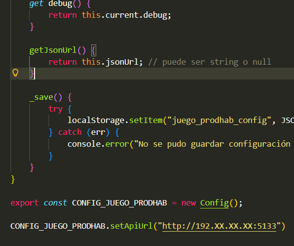
</p>

#### 2-Configurar la uicación específica de imágenes y assets:

Dentro de la carpeta de `src` de web, se encuentra :

```
vanillaJSESModule\src\juegosAssets.js
```

n el archivo `juegosAssets.js`, si los archivos se encuentran en otra ubicación, se debe modificar la ruta. En cambio, si los archivos se descargan y se encuentran dentro del mismo servidor de la página, ya sea en la web o en la carpeta `wwwroot`, no es necesario modificar nada, ya que por defecto se buscan las imágenes en la URL del servicio donde se está ejecutando la aplicación.

En caso de que se desea modificar sería al final del mismo archivo indicar:

```
setRootPath('http://localhost:8080/')
```

**En el código:**

<p align="center">
  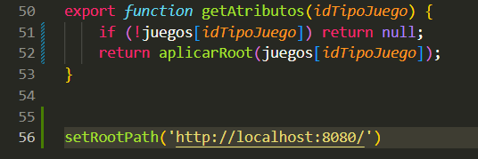
</p>

#### 3-Mover todos los archivos que está dentro de la carpeta`vanillaJSESModule` a `wwwroot`.

- Este paso solo es en el caso de que el proyecto se encuentra en el mismo proyecto. En el caso de que sea en un `frontend` diferente no es necesario realizarlo de esta manera.

- En este caso no es necesario modificar archivos, debido a que wwwroot define la raíz pública y queda como por defecto con la URL del servidor que se encuentra.

<p align="center">
  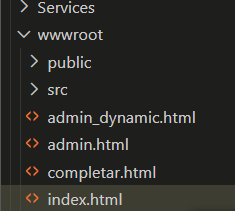
</p>

### Ejecutar o iniciar el proyecto para :

Luego de haber realizado todos los pasos anteriores puede iniciar el proyecto desde el _cmd_ o _terminal_ con el comando `dotnet run` desde el directorio `APIJuegos`:

```
APIJuegos>dotnet run
```

La terminal debe mostrar algo similar a esto:

<p align="center">
  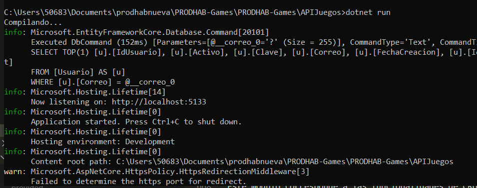
</p>

Para ver la interfaz gráfica de los juegos puede ingresar desde el buscador el servidor local del proyecto + el nombre del archivo a mostrar:

```
http://localhost:5133/index.html
```

## Desplegar el proyecto en un servidor:

#### 1-Compilar en modeo Release el proyecto

Ejecutar el comando `dotnet publish -c Release -o ./publish` en la terminal para crear y empaquetar los archivos a producción.

```
APIJuegos>dotnet publish -c Release -o ./publish
```

#### 2-Ubicar el archivo `.dll` generado en la nueva carpeta `./publish` y ejecutar el siguiente comando `dotnet ./publish/APIJuegos.dll` para verificar el funcionamiento:

```
APIJuegos>dotnet ./publish/APIJuegos.dll
```

<p align="center">
  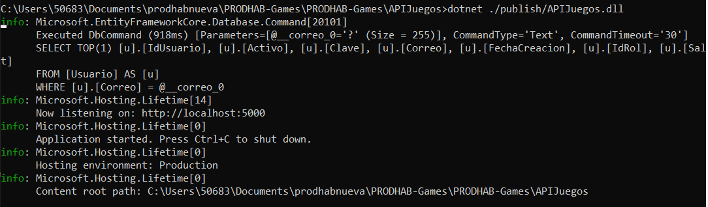
</p>

#### Alojar la carpeta `./publish` en un servidor

En este caso existe varias alternativas:

- Usa FTP, SFTP, SCP o cualquier método de transferencia para llevar la carpeta publish al servidor usando VSCode o FileZilla.
  [Instrucciones para publicar con FTP](https://www.youtube.com/watch?v=Tby8_DUhlLg).

- Publicar un proyecto .NET usando un perfil de publicación (Publish Profile), que es la forma más sencilla desde Visual Studio o VS Code para desplegar a un servidor, IIS, Azure, FTP, etc.
  [Instrucciones para publicar con perfil](https://www.youtube.com/watch?v=UBDE7b2jnm0&t=330s).

## Crear el módulo administrador en versión escritorio.

Este módulo corresponde a las funcionalidades de CRUD y modificaciones en los juegos. Se describirá sobre como implementar el componente en una página. Sin embargo se acordó que este módulo puede implementarse en entorno de escritorio a través del marco de trabajo `Electron.JS` al ser una herramienta de uso interno.

### Dependencias necesarias

1-Descargar el framework principal que permite crear aplicaciones de escritorio usando JavaScript, HTML y CSS.

```
npm install --save-dev electron
```

2-Descargar la herramienta para empaquetar la app y crear instaladores.

```
npm install --save-dev electron-builder
```

### Archivo package.json

En vez de instalar las dependencias una por una puede usar el siguiente archivo:

```json
{
  "name": "escritorio-prodhab",
  "version": "1.0.0",
  "description": "Aplicación de escritorio de PRODHAB Games con Electron",
  "main": "main.js",
  "author": "Practicantes PRODHAB",
  "license": "ISC",
  "scripts": {
    "start": "electron .",
    "build": "electron-builder"
  },
  "build": {
    "appId": "com.prodhab.games",
    "productName": "PRODHAB Games",
    "directories": {
      "output": "dist"
    },
    "files": ["**/*", "assets/**"],
    "win": {
      "target": "nsis",
      "icon": "assets/super.ico"
    }
  },
  "devDependencies": {
    "electron": "^39.0.0",
    "electron-builder": "^25.1.8"
  }
}
```

Ejecutar el comando en la ubicación del proyecto para escritorio:

```
\adminJuegosEscritorio> npm installl
```

### Copiar la carpeta `vanillaJSESModule` y pegarlo en `adminJuegosEscritorio`.

<p align="center">
  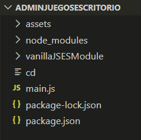
</p>

### Crear el archivo main.js en caso de que no exista y poner lo siguiente:

Dentro de la función createWindow debe especificar donde está el archivo admin.html que sería la página de administrador que se va a mostrar.

```javaScript
win.loadFile(path.join(__dirname, "vanillaJSESModule/admin.html"));
```
**main.js**

```js
const { app, BrowserWindow } = require('electron');
const path = require('path');

function createWindow() {
  const win = new BrowserWindow({
    width: 1200,
    height: 800,
    icon: path.join(__dirname, 'assets', 'super.ico'), 
    webPreferences: {
      nodeIntegration: true,
    },
  });

  // Carga un archivo HTML local
  win.loadFile(path.join(__dirname, 'vanillaJSESModule/admin.html'));
}

app.whenReady().then(createWindow);

app.on('window-all-closed', () => {
  if (process.platform !== 'darwin') app.quit();
});

```


### Ejecutar el comando `npm start` para probar:

```
\adminJuegosEscritorio>npm start
```
<p align="center">
  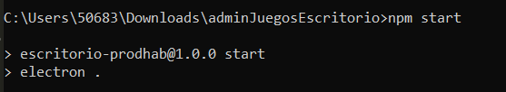
</p>

Una vez ejecutado aparecerá la aplicación de escritorio.


### Modificar la URL Base de la API para que apunte a tal servidor:

En caso de que la URL de la api es dinámica o no se haya establecido, puede modificar la URL haciendo clic al inicio de la aplicación en la perte que dice `Ajuste`, posteriormente le aperecerá un diálogo solicitando la nueva dirección de URL a apuntar:

<p align="center">
  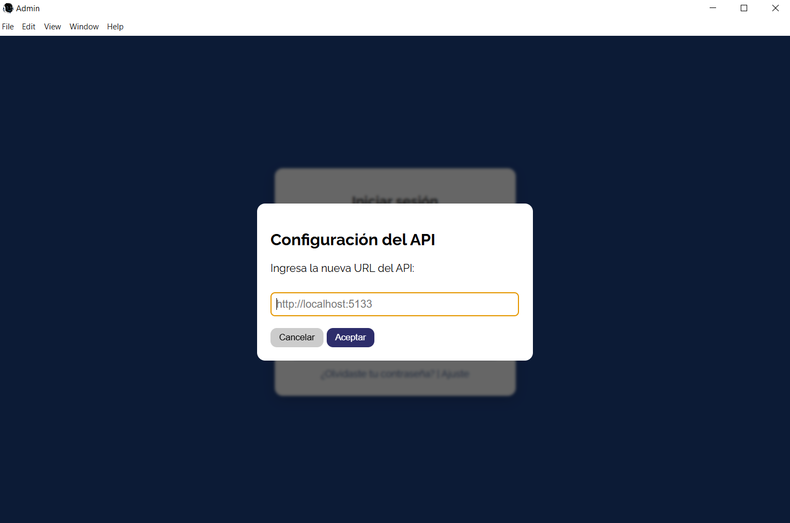
</p>


En el caso de que se desea restablecer la URL Base puede ingresar a las herramientas de desarrollador:

<p align="center">
  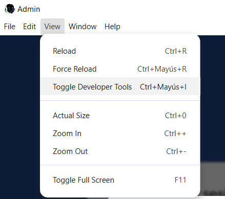
</p>

Ir a applications o aplicaiones y borrar todo el localstorage:


<p align="center">
  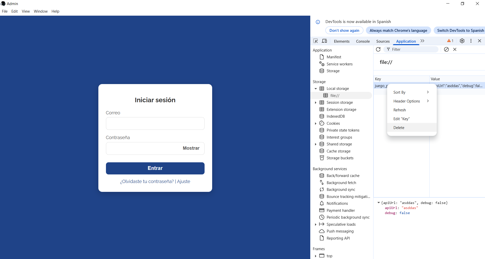
</p>

Clic derecho y borrar todo el localstorage, luego solo debe cerrar y volver abrir el programa.

### Crear el proyecto en un ejecutable .exe


#### Ejecutar el comando `npm build` para construir:

```
\adminJuegosEscritorio>npm build
```
Posterior a la ejecución del comando se crea un carpeta `dist` dentro del proyecto y para abrir la aplicación debe hacer doble clic en el `.exe`. Se recomienda no mover el `.exe` y ningún otro archivo que está dentro del `dist`, sin embargo si se puede compartir o mover dicha carpeta en otra ubicación.

## Recomendaciones y futuras mejoras

Primero que nada, para las personas que vayan a implementar este proyecto, pedimos disculpas en caso de que surjan complicaciones al ejecutar el proyecto o durante las pruebas de integración.

La mayor parte de este proyecto enfrentó varias complicaciones debido a que, inicialmente, no contábamos con experiencia en las tecnologías utilizadas en la página principal, así como a la falta de comunicación clara con el cliente para evitar tecnicismos. Por esta razón, decidimos desarrollar la aplicación de juegos utilizando JavaScript, HTML y CSS sin ningún framework específico, con el objetivo de que los componentes fueran adaptables y reutilizables en cualquier entorno. Esta decisión impactó no solo la complejidad del proyecto, sino también su mantenibilidad y la calidad esperada.

Se recomienda, para futuras versiones del proyecto, considerar los siguientes puntos:

* Desarrollar o migrar la aplicación al framework utilizado por la página principal.

* Actualizar el proyecto respetando los principios de código limpio y mejorando la mantenibilidad.

* Generar pruebas unitarias en cada elemento o capa del proyecto.

* Normalizar la base de datos.

* Mejorar la lógica de acceso de datos, de negocio y el uso del ORM.

Gran parte de estas recomendaciones no se lograron debido a los frecuentes cambios y adiciones de nuevos requerimientos, así como a la falta de experiencia inicial.